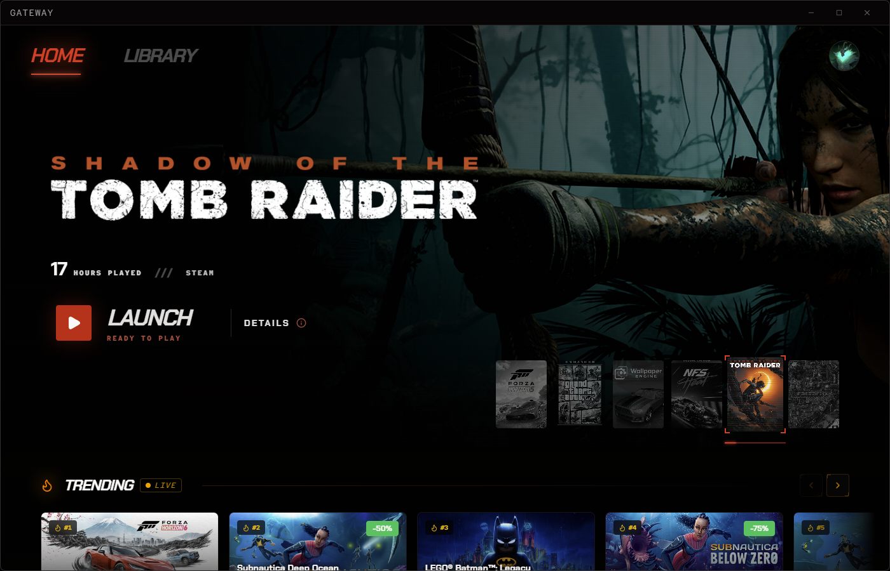
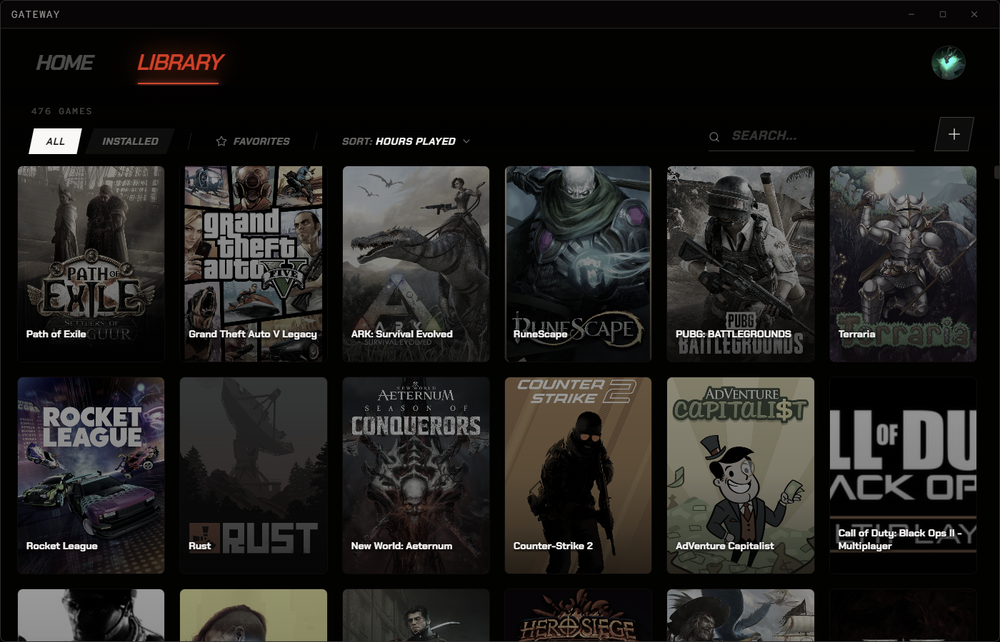

# Gateway

[](https://github.com/ProfetGit/Gateway/actions/workflows/ci.yml)

A Windows game launcher for your Steam library, with a deliberately opinionated OLED-first interface.

Gateway surfaces your Steam library alongside live catalog data (trending, free-to-keep deals) and tracks achievement progress across your games — without re-implementing a storefront. Local-first by design: your library lives in a JSON file on disk, covers are mirrored locally, and external APIs only fire when their data is needed.

---

## Screenshots





---

## Features

- **Steam library** — Local-file scan of installed games plus Web-API import of your full owned catalog.
- **Trending row** — Live data from the Steam featured-categories API, with one-click open in the Steam client.
- **Free-to-Keep deals** — Temporarily-free Steam games via the GamerPower API, with claim-state tracking. Gateway detects when you successfully claim a game and updates the badge automatically.
- **Achievement Hunts** — Cross-game achievement progress with a sortable, filterable drawer (in progress / almost done / completed / untouched / all).
- **Per-game detail** — Banner art, developer info, achievements tab, patch notes (Steam news API), custom launch arguments.
- **Asymmetric cinematic UI** — Custom design system (Crimson Void): OKLCH color palette, Chakra Petch + Red Hat Mono + Archivo Black typography, signature corner-bracket card vocabulary, scanline overlays. No shadcn, no glassmorphism, no purple gradients.

---

## Tech stack

- **Electron 30** (frameless window, custom protocol for local cover assets)
- **React 18** + **TypeScript 5** (renderer)
- **Vite 5** + `vite-plugin-electron` (dev + build)
- **Tailwind CSS 4.0** (CSS-first config via `@tailwindcss/vite`, OKLCH palette)
- **Framer Motion** for entrance/transition animation
- **Zustand** for renderer state
- **JSON file store** for persistence (`{userData}/gateway-data.json` — no SQL)

External APIs used: Steam Web API, Steam Store API, Steam featured-categories, GamerPower (free deals).

---

## Requirements

- **Windows 10/11**
- **Node.js 18+** and **npm**
- **Git**
- A working **Steam installation** is required for the Steam library scanner to find local games.
- A **Steam Web API key** is required for achievement and ownership features. Get one at https://steamcommunity.com/dev/apikey. Without it, Gateway still works — Trending, Free Deals, and the local library scanner do not need a key, but Achievement Hunts and "Owned" tagging on trending cards will not populate.

---

## Development

```bash
# Install
git clone <repo-url>
cd Gateway
npm install

# Run in dev (Vite HMR + Electron auto-reload, devtools auto-open)
npm run dev

# Typecheck only (fast)
npx tsc --noEmit

# Lint (max-warnings 0)
npm run lint

# Run tests
npm test

# Build production binaries (electron-builder)
npm run build
```

The dev command boots Vite's dev server and Electron together. Save any renderer file and HMR will update without losing state. Save any `electron/**/*.ts` file and the main process restarts automatically.

Build artifacts:
- `dist/` — renderer bundle
- `dist-electron/` — main + preload bundles
- `release/` — packaged installers (after `npm run build`)

---

## Configuration

Gateway stores all user data in the Electron `userData` directory at `%APPDATA%\Gateway\gateway-data.json`.

The file holds your library, settings, and claim state. It is human-readable JSON — you can back it up, edit it, or version-control it.

Steam Web API key entry is in the in-app settings panel. It is stored in the same JSON file.

---

## Project structure

```
electron/                    Main process (Node) + preload bridge
  main.ts                    BrowserWindow boot, gateway:// protocol, handler wiring
  preload.ts                 contextBridge → window.api (single IPC surface)
  src/
    shared/                  JsonStore, types, constants, cover-mirroring utils
    features/                Per-domain IPC handlers
      steam/                 Trending, free deals, achievements, news, store API
      library/               Local library CRUD
      sync/                  Steam sync + claim-detection

src/                         Renderer (React)
  App.tsx                    AppShell root — all modal overlays mount here
  stores/                    Zustand stores (gameStore is the spine)
  components/                Shared UI primitives, layout, auth, game cards
  features/                  Home-page sections (trending, free-deals, achievement-hunts)
```

See [`CLAUDE.md`](CLAUDE.md) for a deeper architecture walkthrough — IPC contract, overlay mounting convention, design-system rules, motion grammar, and caching strategy.

---

## Contributing

Contributions welcome. Before opening a PR:

1. Run `npx tsc --noEmit` — typecheck must pass
2. Run `npm run lint` — ESLint runs with `--max-warnings 0`
3. Run `npx vite build` — production build must succeed
4. Match the existing design system. The codebase enforces strict rules around color (OKLCH only, no pure black/white), typography (banned font list), and motion (no hover springs, no animated layout properties). See [`CLAUDE.md`](CLAUDE.md) → "Design system (enforced)".
5. Overlays/modals/drawers must mount at `App.tsx` root with state in `gameStore` — never in feature trees. The HomeView stacking context will trap nested overlays under the top navigation.

Bug reports and feature requests via GitHub issues. Please include OS, Electron/Node version, and reproduction steps.

---

## License

[MIT](LICENSE) — fork, modify, and redistribute freely. No warranty.

---

## Acknowledgements

- Game catalog data from the [Steam Store API](https://store.steampowered.com/) and [Steam Web API](https://steamcommunity.com/dev).
- Free-to-keep deal listings from [GamerPower](https://www.gamerpower.com/).
- Cover art served via Steam CDN; mirrored locally for offline access.

This project is not affiliated with or endorsed by Valve.
